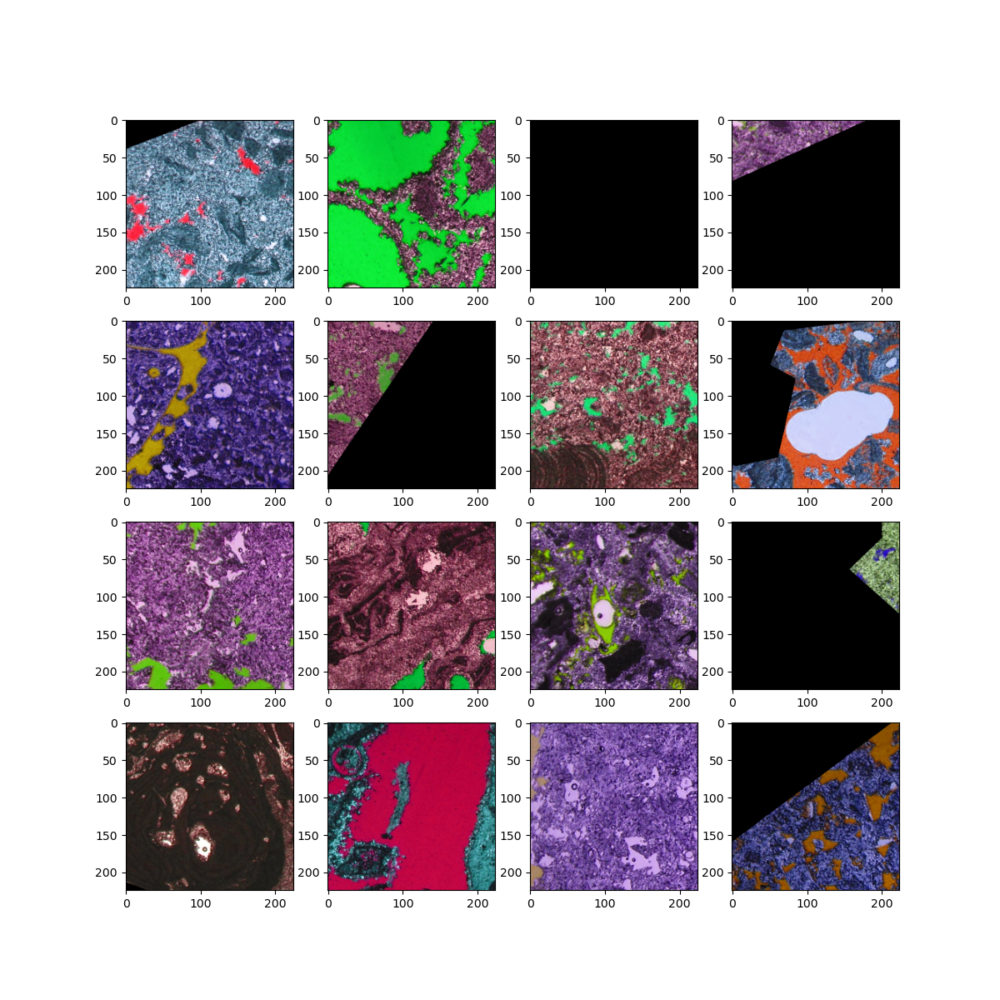
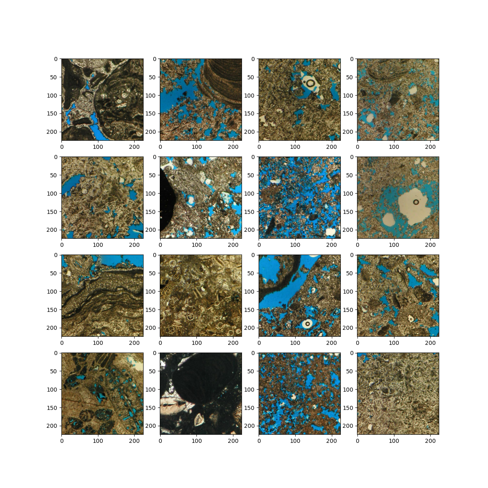

# Neural Rock
## Do Machines See Rocks Like Geologists Do?

### Authors

[Gregor Baechle](https://www.linkedin.com/in/gbaechle/), [George Ghon](https://www.linkedin.com/in/george-g-30015639/), [Lukas Mosser](https://at.linkedin.com/in/lukas-mosser)  
_Carbonate Complexities Group_, 2020

## Introduction

This project aims to investigate the ability of neural networks to classify carbonate rocks from thin-sections for 
various carbonate classification schemes. More importantly, we seek to understand whether neural networks
use similar visual and textural features to classify each image. 

To investigate this we use the Gradient Class Activation Maps (GradCAM) [Distill.Pub Article](https://distill.pub/2020/attribution-baselines/) to show highlighting features
where a neural network is "looking" in an image to make its decision on which carbonate class to predict.

These class activation maps are dependent on the architecture and weights of a model and we therefore provide 
here pre-trained models and code infrastructure to train various convolutional networks and a viewer application 
to visualize the CAM maps and the predictions of each network.

Due to the extremely small dataset of ~80 images, a transfer learning approach was used to train ImageNet pretrained models.
Because each image has dimensions of > 3000 x 2000 pixels, we randomly extract patches at 224x224 pixels and apply feature preserving
data augmentation to regularize model training and to (hopefully) prevent overfitting. Regardless, results should be evaluated on the
test-splits of the datasets, indicated in the viewer app for each model.  

### Network types

We provide pretrained ResNet18 and VGG11 models that either use ImageNet pretrained activations in the feature 
extractor or have been fine-tuned by training of the feature extractor with a very small learning rate.

## Neural Rock Application

We provide a viewer application that allows inspection and visualization of the results.
To run the application first, install [Docker](https://docs.docker.com/compose/), and [Docker-Compose](https://docs.docker.com/compose/).

Once finished start the application by calling:
```bash
docker-compose up -d 
```
and navigating to the viewer at [localhost/viewer](http://localhost/viewer).

You should be greeted by the following interface:


Here you can switch between different carbonate classification schemes (Labselset Name),
different CNN architectures (Model Selector), whether to use a frozen or a trained feature extractor 
(Frozen Selector), and the network layer to visualize for CAM maps (Network Layer Number). You can select the class you want to activate the network (Class Name), and finally a selection of all the images in the dataset with an indication on whether they were used in the training set, or not, as well as their 
ground-truth label, as identified by a carbonate geologist.

A histogram of the predictions for the network is given below.  

Once you have finished working with the application you can shut-down the Docker container:
```bash
docker-compose down
```

If you wish to inspect the logs while the application is running run in a terminal:
```bash
docker-compose logs -t -f
```
which will show you a running log of the application status while you work with it.

The viewer builds on [Panel](https://panel.holoviz.org/reference/panes/HoloViews.html), [Holoviews](https://holoviews.org/), and [Bokeh](https://docs.bokeh.org/en/latest/index.html)

Docker Images are hosted on [Dockerhub](https://hub.docker.com/repository/docker/lmoss/neural-rock).

### API Specification

Interested viewers can also access the api that runs behind the scenes to serve model predictions.
Navigate in your browser to [http://localhost:8000/docs](http://localhost:8000/docs) once the app is 
running to see the OpenAPI specification. The API is built on [FastAPI](https://fastapi.tiangolo.com/)

### Deploying on AWS

For sharing we have used [Hashicorp Terraform](https://www.terraform.io/) to provide an Infrastructure as Code that will 
deploy a worker on AWS EC2. This allows us to reduce manual work for spinning-up a machine that serves the model.  
Integrating an [Ansible Playbook](https://www.ansible.com/) could be considered future work.

### Model Training

To load a notebook for training a model in Google Colab, follow this link:  
[](https://colab.research.google.com/github/LukasMosser/neural_rock_typing/blob/main/notebooks/Neural_Rock_Typing_Sweep_Train_All_Models.ipynb)

_Update May 2021:_
There seems to be an issue with Colab crashing due to incompatibility with Pytorch Lightning
Training of individual models can also be performed via `train/train.py`

We have made use of [Weights And Biases](https://wandb.ai) to organize all our ML experiments.
The dashboard for all model training runs executed as a sweep can be found [here](https://wandb.ai/ccg/neural-rock-finak-2).


To make training on google colab efficient we preload the entire dataset onto the GPU as to keep hard-disk and cloud storage latency to a minimum.

### Dataset and Weights

The dataset and model weights will be released in the coming weeks, but are included in the docker-images, so 
you are ready to run if you wish to play with the application locally.

### Dataset Augmentation

We make use of heavy dataset augmentation to ensure the network focuses on textural features.
We therefore perform colorspace jittering in HSV space as a data-augmentation.
Here a batch of images as the network sees them at training time:



During prediction time we only crop and resize the images, but do not perform any color-jittering
as to preserve the image dataset color distribution.
Here a batch of images as seen during the validation step:


## Future Work

Some initial testing has been done to incorporate [Captum](https://captum.ai/) to provide other model interpretability methods
for CNNs, but there is no time left in the project to implement this currently.

In terms of deployment, there is much room for improvement as the application does not "scale" currently.  
The process of building a well-scaling application that builds on machine learning beyond the *How to deploy your sklearn model on AWS Lambda Tutorial* 
is a non-trivial task especially if you can't make use of good inference libraries that take care of a lot of that work for you.
In our case, RAM requirements are quite high due to the need for backpropagation to obtain the CAM maps. That puts special burden on deployment infrastructure.  
Nevertheless, one could design a better system to scale out the API using AWS ECS or similar approaches, maybe even Lambda type functions.  
Definitely something to learn for the future :) 

Unit and Integration Tests: The cake was a lie...

## Data Acknowledgment

This research used samples and data provided by the following dissertation:

_Baechle, Gregor (2009): "Effects of pore structure on velocity and permeability in carbonate rocks" dissertation at Mathematisch-Naturwissenschaftliche Fakultät of Eberhard Karls University Tuebingen.
http://hdl.handle.net/10900/49698_


The image data for the PhD has been acquired while conducting research at the University of Miami, Comparative Sedimentology Laboratory.


## Credit and Thanks

If you find this useful feel free to credit where appropriate.  
A detailed publication on the outcomes of our findings is in the works.

We also wish to thank the organizers of the [Full Stack Deep Learning Course](https://fullstackdeeplearning.com/) for an excellent programme 
and for providing an incentive to create and share this work. 

Libraries and Articles that have contributed to this repository:

[Full Stack Deep Learning](https://fullstackdeeplearning.com/),
[pytorch-grad-cam by JacobGil](https://github.com/jacobgil/pytorch-grad-cam),
[Terraform with Nana](https://www.youtube.com/watch?v=l5k1ai_GBDE),
[Distill.Pub](https://distill.pub/)
[Pytorch](https://pytorch.org/),
[Google Colab](https://colab.research.google.com),
[Pytorch Lightning](https://pytorch-lightning.readthedocs.io/en/latest/),
[Weights And Biases](https://wandb.ai),
[Captum](https://captum.ai/),
[Panel](https://panel.holoviz.org/reference/panes/HoloViews.html),
[Holoviews](https://holoviews.org/),
[Bokeh](https://docs.bokeh.org/en/latest/index.html),


